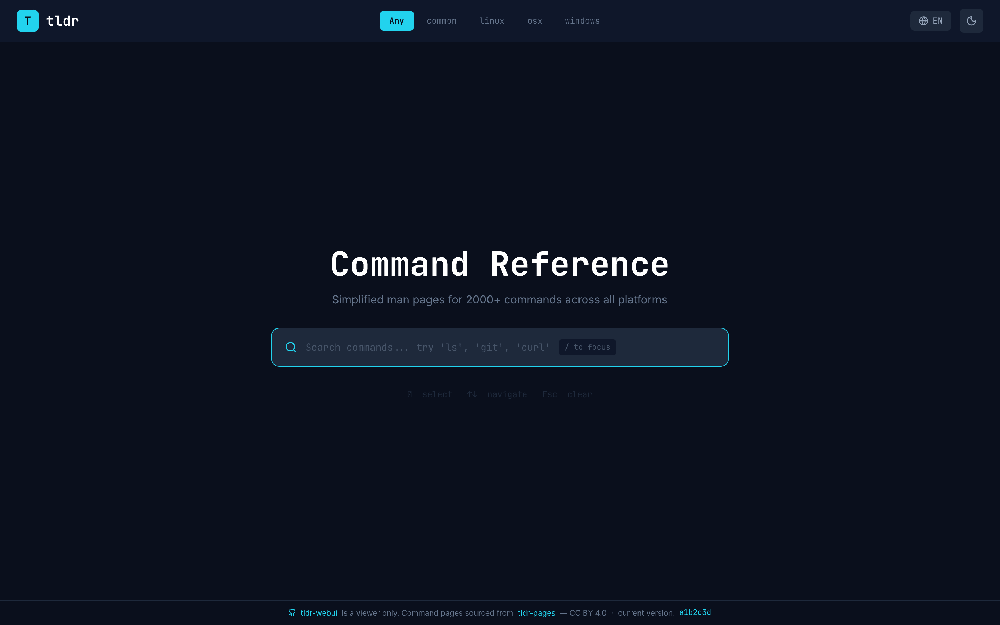
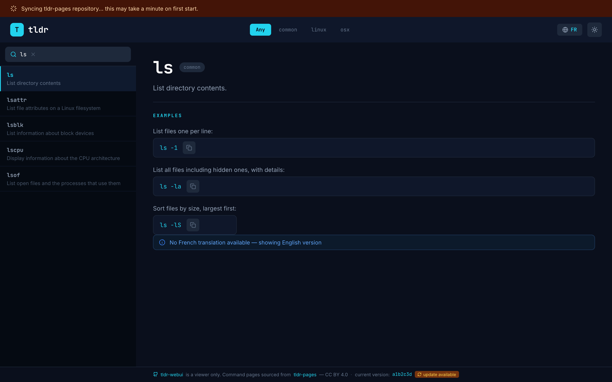

# tldr-webui


A self-hosted web interface for browsing [tldr-pages](https://github.com/tldr-pages/tldr) — the community-maintained collection of simplified, practical command reference pages. Packaged as a single Docker container with automatic data synchronization.

> **Note**: tldr-webui is a viewer only. All command reference content is sourced from the [tldr-pages project](https://github.com/tldr-pages/tldr) and is licensed under [CC BY 4.0](https://creativecommons.org/licenses/by/4.0/).

---

## Table of Contents

- [Features](#features)
- [UI Overview](#ui-overview)
- [Quick Start](#quick-start)
- [Configuration](#configuration)
- [Development Setup](#development-setup)
- [Architecture](#architecture)
- [API Reference](#api-reference)
- [Attribution](#attribution)
- [License](#license)

---

## Features

- **Full tldr-pages browser** — search across all commands, browse by platform, read formatted pages with copy-to-clipboard on every example
- **38 languages supported** — language is auto-detected from the browser and persisted in a cookie; manually selectable via dropdown; falls back to English with a notice when a translation is unavailable
- **10 platform filters** — `common`, `linux`, `osx`, `windows`, `android`, `freebsd`, `netbsd`, `openbsd`, `sunos`, `cisco_ios`
- **Fast keyboard-driven search** — debounced live search, activated with `/` or `Ctrl+K` from anywhere on the page
- **Dark / light theme** — defaults to dark mode, toggle persisted across sessions
- **PWA installable** — can be added to the home screen or desktop as a standalone app, using the official tldr-pages logo as the icon
- **Automatic data sync** — on startup the container clones or pulls the tldr-pages repository in the background; the UI is immediately available and shows a sync banner until the operation completes
- **Health endpoint** — `/api/health` returns uptime and version, suitable for container health checks and monitoring

---

## UI Overview

The application has two distinct layouts depending on whether a search is active.

### Home / hero state (no active search)



### Results state (query entered)



Key UI behaviours visible in the screenshots above:

- The **amber sync banner** (shown below the navbar) appears only while the container is cloning the tldr-pages repository on first start, and disappears automatically once sync completes.
- **Platform tabs** (`common`, `linux`, `macos`, `windows`, `android`, `freebsd`, `netbsd`, `openbsd`, `sunos`, `cisco`) are available both on the home screen and in the compact sidebar.
- The left sidebar **command list** highlights the active entry with a coloured left border. Commands that only have an English fallback (when a different language is selected) show a small `EN` label.
- Each **code example** in the right panel renders in a styled box with a one-click copy button. Template placeholders such as `{{path}}` are highlighted in amber.
- A **blue notice** is shown at the top of the page content when the selected language has no translation and the English version is being displayed instead.

---

## Quick Start

### Prerequisites

- Docker and Docker Compose (v2)
- Outbound internet access from the container (to clone tldr-pages on first run)

### Start with Docker Compose (pre-built image)

```bash
curl -O https://raw.githubusercontent.com/acaranta/tldr-webui/main/docker-compose.yml
docker compose up -d
```

### Build from source

```bash
git clone https://github.com/acaranta/tldr-webui.git
cd tldr-webui
docker compose up --build -d
```

The application will be available at **http://localhost:8129**.

On first start, the container clones the tldr-pages repository into the `tldr-data` volume. This takes roughly 30–60 seconds depending on network speed. The UI is accessible immediately and displays an amber sync banner until the clone completes. On subsequent restarts, the container performs a fast `git pull` instead.

### Start with Docker CLI

```bash
docker run -d \
  --name tldr-webui \
  -p 8129:3000 \
  -v ./tldr-data:/tldr-pages \
  --restart unless-stopped \
  acaranta/tldr-webui:latest
```

---

## Configuration

### Port

The container exposes port `3000` internally. The `docker-compose.yml` maps it to `8129` on the host. Change the host-side port by editing the `ports` mapping:

```yaml
ports:
  - "YOUR_PORT:3000"
```

### Volume

tldr-pages data is stored in the `tldr-data` bind mount defined in `docker-compose.yml`. The path inside the container is `/tldr-pages`. The entrypoint fixes ownership at startup so the unprivileged `nextjs` user can write to it regardless of the host UID that created the directory.

### Environment Variables

| Variable                  | Default        | Description                                                  |
|---------------------------|----------------|--------------------------------------------------------------|
| `TLDR_PATH`               | `/tldr-pages`  | Override the path where tldr-pages data is read from        |
| `NODE_ENV`                | `production`   | Node environment (set automatically in the container)        |
| `NEXT_TELEMETRY_DISABLED` | `1`            | Disables Next.js telemetry (set automatically)               |

To use a custom tldr-pages path, add it to the `environment` section of `docker-compose.yml`:

```yaml
environment:
  - TLDR_PATH=/data/my-tldr-pages
```

### Health Check

The `docker-compose.yml` includes a health check that polls `/api/health` every 30 seconds:

```yaml
healthcheck:
  test: ["CMD", "wget", "-qO-", "http://localhost:3000/api/health"]
  interval: 30s
  timeout: 5s
  retries: 3
  start_period: 10s
```

---

## Development Setup

### Prerequisites

- Node.js 20+
- npm

### Install and Run

```bash
npm install
npm run dev
```

The development server starts at **http://localhost:3000**.

PWA features are disabled in development mode (`NODE_ENV=development`). To test with real tldr-pages data locally, clone the repository and point the app at it:

```bash
git clone --depth=1 https://github.com/tldr-pages/tldr /tmp/tldr-pages
TLDR_PATH=/tmp/tldr-pages npm run dev
```

### Build

```bash
npm run build
npm start
```

### Lint

```bash
npm run lint
```

---

## Architecture

### Container Startup Sequence

1. The entrypoint (`entrypoint.sh`) runs as `root`.
2. It fixes ownership of the `/tldr-pages` volume mount so the `nextjs` user can write to it.
3. It writes an initial `{"status":"syncing"}` file to `/tmp/tldr-sync.json`.
4. It launches a background shell that either clones (first run) or pulls (subsequent runs) the tldr-pages repository via `git`, then updates the status file to `ready` or `error`.
5. It immediately drops privileges using `su-exec` and starts the Next.js standalone server.

The UI polls `/api/sync-status` and shows or hides the sync banner based on the response.

### Data Flow

```
Browser → Next.js API routes → src/lib/tldr.ts → /tldr-pages filesystem
```

The `tldr.ts` library performs all reads directly from the filesystem — no database, no in-memory index. Search is a prefix scan over directory entries. Page content is read and returned as raw Markdown, rendered client-side by `react-markdown`.

### Language Fallback

When a page is requested in a non-English language and no translation exists, the library returns the English page with `fallback: true`. The UI shows a blue informational notice to the user.

### Docker Image Layers

The Dockerfile uses a three-stage build:

| Stage     | Base image       | Purpose                                               |
|-----------|------------------|-------------------------------------------------------|
| `deps`    | `node:20-alpine` | Install npm dependencies with `npm ci`                |
| `builder` | `node:20-alpine` | Copy source, download PWA icons, run `next build`     |
| `runner`  | `node:20-alpine` | Copy standalone output, add `git` and `su-exec`, run  |

The final image contains only the standalone Next.js output and no build-time tooling.

---

## API Reference

All endpoints are served by Next.js API routes under `/api/`.

### `GET /api/health`

Returns application status, version, and uptime. Used by the Docker health check.

**Response**

```json
{
  "status": "ok",
  "version": "0.1.0",
  "uptime": 142
}
```

### `GET /api/sync-status`

Returns the current state of the background tldr-pages git synchronization.

**Response**

```json
{ "status": "syncing" }
{ "status": "ready" }
{ "status": "error" }
```

### `GET /api/commands`

Search for commands by name.

| Parameter  | Type   | Default    | Description                          |
|------------|--------|------------|--------------------------------------|
| `q`        | string | —          | Search query (required)              |
| `platform` | string | `common`   | One of the supported platform values |
| `lang`     | string | `en`       | BCP 47 language code                 |

**Response** — array of matching command entries:

```json
[
  { "command": "git", "platform": "common", "hasTranslation": true }
]
```

### `GET /api/page`

Retrieve the Markdown content of a specific command page.

| Parameter  | Type   | Default    | Description                          |
|------------|--------|------------|--------------------------------------|
| `command`  | string | —          | Command name (required)              |
| `platform` | string | `common`   | One of the supported platform values |
| `lang`     | string | `en`       | BCP 47 language code                 |

**Response**

```json
{
  "content": "# git\n\n> ...",
  "fallback": false,
  "platform": "common",
  "lang": "en"
}
```

Returns `404` if the command is not found on any platform.

---

## Attribution

All command reference content is provided by the [tldr-pages project](https://github.com/tldr-pages/tldr) and its contributors, licensed under [Creative Commons Attribution 4.0 (CC BY 4.0)](https://creativecommons.org/licenses/by/4.0/).

The tldr logo used as the PWA icon is downloaded directly from the tldr-pages repository during the Docker build.

tldr-webui is an independent viewer and is not affiliated with or endorsed by the tldr-pages project.

---

## License

The tldr-webui application code is provided as-is. Content displayed by the application is licensed under [CC BY 4.0](https://creativecommons.org/licenses/by/4.0/) by the tldr-pages contributors.

---

## Development Notes

To be transparent : This project was developed with the assistance of AI language models under human supervision. by a bearded NERD :)
